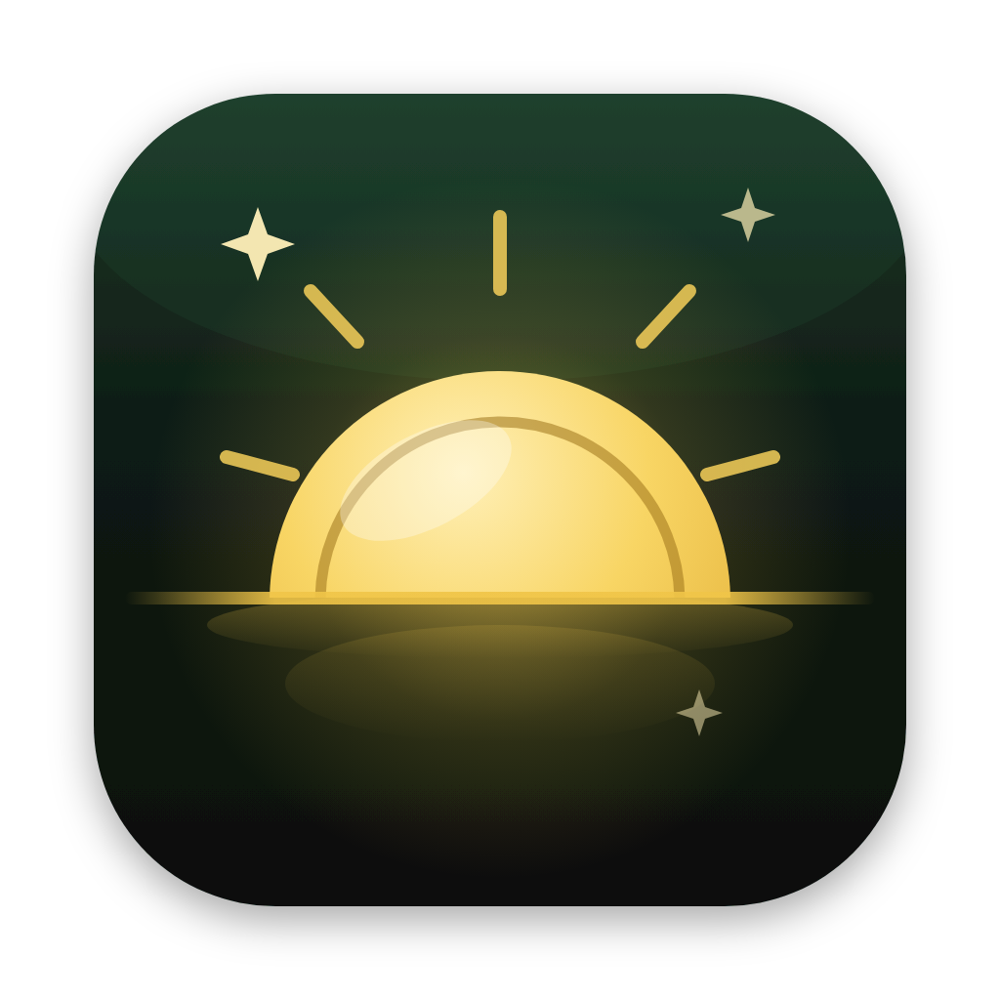
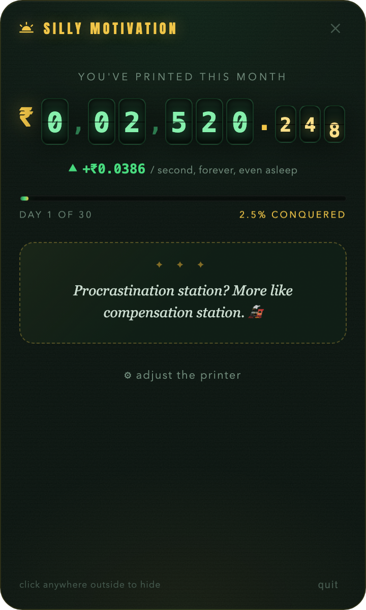

<p align="center">
  
</p>

<h1 align="center">Silly Motivation</h1>

<p align="center">Your salary, ticking up every second, in your menu bar.</p>

<p align="center">
  
</p>

Type your monthly salary in any currency. Watch yourself earn it in real time — every second, even in your sleep. That's it. That's the app.

## Install

Download from [Releases](../../releases), or build it yourself:

```bash
cargo install tauri-cli --version "^2"
cd src-tauri && cargo tauri build
```

## Platforms

|             |                                                              |
| ----------- | ------------------------------------------------------------ |
| **macOS**   | Live counter right in the menu bar, next to your battery     |
| **Windows** | Counter rendered inside the tray icon, full amount on hover  |
| **Linux**   | Tray icon counter + label on KDE; popover via the tray menu  |
| **iPhone**  | Home screen + lock screen widgets, live counter in the app   |

### iPhone

```bash
cd ios && xcodegen generate && open SillyMotivation.xcodeproj
```

Hit ▶ in Xcode. Add the **Money Printer** widget to your home screen or lock screen.
(Widget numbers refresh every minute — iOS doesn't allow faster. The app itself ticks live.)

## License

[MIT](LICENSE) — silly by design.
